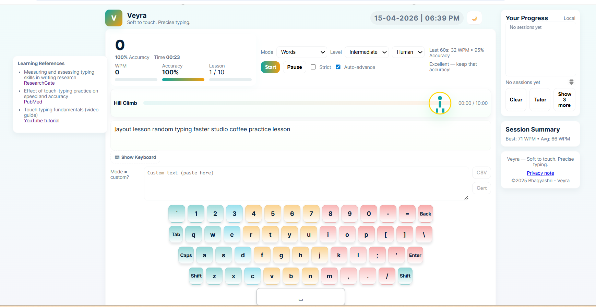
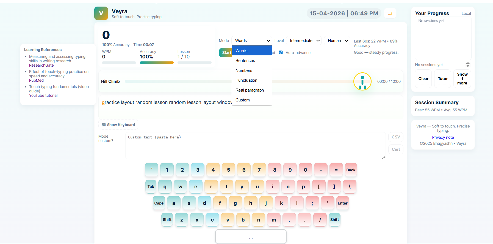
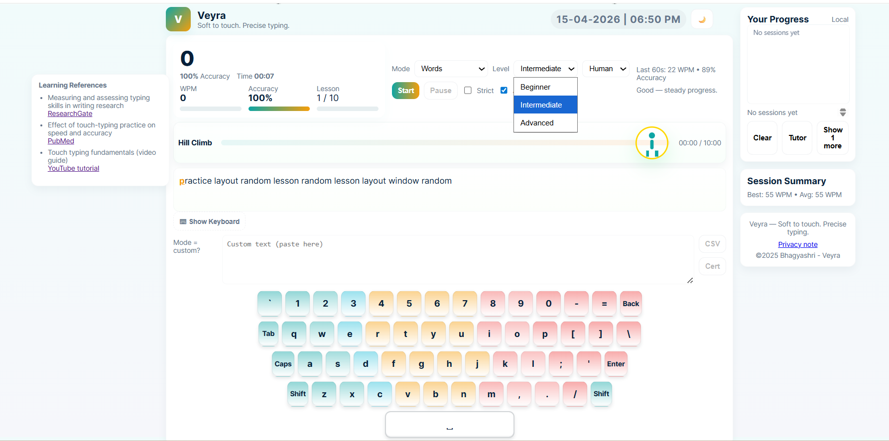
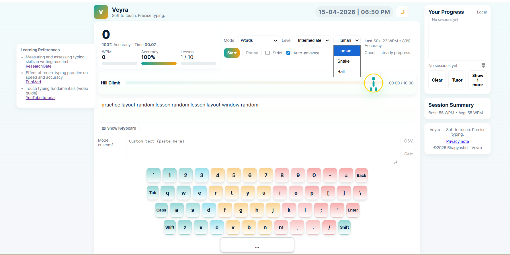
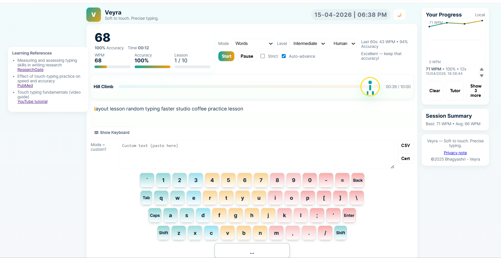

## 🌐 Live Demo
Try Veyra here: https://bhagyashri1124.github.io/Veyra/

# Veyra

Veyra is a modern Touch Typing Practice Web App for learners designed to help users improve typing speed, accuracy, and muscle memory through interactive practice.

## About Veyra
Veyra is my first web application project focused on creating a clean and beginner-friendly typing practice platform. The goal of Veyra is to make touch typing learning simple, engaging, and effective.

## Features
- Real-time typing speed tracking
- Accuracy analysis
- Clean and modern interface
- Beginner-friendly touch typing practice system

## 📸 Preview

### 🖥️ Main Interface

  

### ⚙️ Modes & Levels

  
  

### 🎮 Interactive Modes & Stats

  
  

## Tech Stack
- Python (Flask)
- HTML
- CSS
- JavaScript

## Project Note
This project is proprietary.  
Source code is NOT open source.  
Commercial use and redistribution are prohibited.

©2025 Bhagyashri
